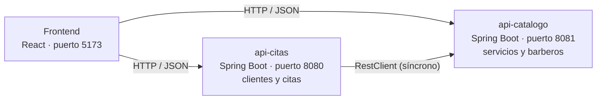

# Sistema de gestión de barbería

Proyecto del segundo corte de **Diseño de Soluciones** — Ingeniería de Sistemas.
Grupo 8: Daniel Felipe Vanegas y Camilo Andrés Paternina.

La barbería agenda citas: cada cita une un cliente, un servicio y un barbero. Partimos el
sistema en dos microservicios con Spring Boot y una interfaz web que los consume.

## Arquitectura



| Parte | Carpeta | Qué hace |
|---|---|---|
| api-catalogo | `api-catalogo/` | CRUD de los servicios que ofrece la barbería y de los barberos. |
| api-citas | `api-citas/` | CRUD de clientes y de citas. Para agendar consulta el servicio y el barbero en api-catalogo. |
| Frontend | `frontend/` | Interfaz web para manejar las cuatro entidades y ver el estado de los microservicios. |

Cada microservicio se ejecuta por separado, tiene sus propios controllers y guarda sus
propios datos. Los datos viven en memoria: al reiniciar un microservicio vuelve a sus datos
de demostración.

### Comunicación entre microservicios

Para agendar una cita el cliente envía solo los IDs:

```json
{ "clienteId": 1, "servicioId": 3, "barberoId": 1, "fechaHora": "2026-12-01T10:00" }
```

1. `CitaController` recibe el `POST /api/citas`.
2. `CitaService` busca el cliente, que pertenece a api-citas.
3. `CatalogoCliente` hace `GET /api/servicios/{id}` y `GET /api/barberos/{id}` a api-catalogo con `RestClient`.
4. Con las tres respuestas se valida la cita, se guarda y se responde `201`.

La comunicación es síncrona: api-citas espera la respuesta de api-catalogo antes de
continuar. Si api-catalogo está apagado, api-citas responde `503` con un mensaje claro y
el resto de sus endpoints (clientes, consultar citas) sigue funcionando. La URL del otro
microservicio está en `application.properties` (`api.catalogo.url`), no en el código.

## Cómo ejecutar

Requisitos: **JDK 17 o superior** y **Node.js 20 o superior**. Maven no hace falta: cada
microservicio trae su wrapper (`mvnw`).

Se abren tres terminales desde la raíz del repositorio.

**1. api-catalogo** (puerto 8081)

```bash
cd api-catalogo
./mvnw spring-boot:run
```

**2. api-citas** (puerto 8080)

```bash
cd api-citas
./mvnw spring-boot:run
```

**3. Frontend** (puerto 5173)

```bash
cd frontend
npm install
npm run dev
```

En Windows (PowerShell o CMD) el wrapper se llama `.\mvnw.cmd`.

| Dirección | Qué hay |
|---|---|
| http://localhost:5173 | Interfaz web |
| http://localhost:8081/swagger-ui.html | Swagger de api-catalogo |
| http://localhost:8080/swagger-ui.html | Swagger de api-citas |

El frontend tiene que correr en el puerto 5173 porque es el único origen que los
microservicios aceptan por CORS (`frontend.url` en cada `application.properties`).

## API REST

La tabla completa de endpoints por controller está en
[docs/endpoints.pdf](docs/endpoints.pdf) (también en Word: `docs/endpoints.docx`).

Los cuatro recursos siguen el mismo esquema:

| Método | Endpoint | Operación |
|---|---|---|
| `POST` | `/api/{recurso}` | Crear |
| `GET` | `/api/{recurso}` | Listar |
| `GET` | `/api/{recurso}/{id}` | Consultar |
| `PUT` | `/api/{recurso}/{id}` | Actualizar |
| `DELETE` | `/api/{recurso}/{id}` | Eliminar |

`{recurso}` es `servicios` o `barberos` en api-catalogo, y `clientes` o `citas` en
api-citas. Además:

- `PATCH /api/citas/{id}/estado` cambia solo el estado de una cita (completar o cancelar).
- `GET /api/conexion/catalogo` comprueba, desde api-citas, que api-catalogo responde.
- `GET /api/status` en cada microservicio.

Los errores siempre llegan como `{"mensaje": "..."}` con el código que corresponde:
`400` datos inválidos, `404` no existe, `409` choca con los datos actuales, `503` el otro
microservicio no respondió.

### JSON y XML

Los `GET` de servicios devuelven JSON o XML según el header `Accept`:

```bash
curl -H "Accept: application/xml" http://localhost:8081/api/servicios/1
```

```xml
<ServicioDTOResponse><id>1</id><nombre>Corte clásico</nombre>...</ServicioDTOResponse>
```

## Reglas del negocio

- Una cita solo se agenda con un servicio y un barbero **activos** en el catálogo.
- No se agendan citas en una fecha pasada.
- Un barbero no puede tener dos citas programadas que se crucen. El cruce se calcula con
  la duración del servicio.
- Una cita nace `PROGRAMADA` y solo puede pasar a `COMPLETADA` o `CANCELADA`. Una vez
  cerrada no se modifica.
- No se elimina un cliente que tenga citas programadas.
- No se repiten documentos de clientes o barberos ni nombres de servicios.
- La cita conserva el nombre y el precio del servicio con los que se agendó, aunque
  después cambien en el catálogo.

## Estructura de cada microservicio

```
controller/   endpoints REST y el manejador de errores
service/      reglas del negocio y datos en memoria
model/        entidades del dominio
dto/          lo que la API recibe (DTORequest) y lo que devuelve (DTOResponse)
cliente/      comunicación con el otro microservicio (solo api-citas)
config/       RestClient y CORS
```

## Lo que aplicamos de cada clase

| Tema | Dónde está |
|---|---|
| Microservicios | Dos aplicaciones Spring Boot independientes, cada una con su puerto y sus datos. |
| API First | Diseñamos primero los recursos y endpoints (`docs/endpoints.pdf`). Swagger UI documenta cada API. |
| Arquitectura por capas | `Controller → Service → Model` en los dos microservicios. |
| Métodos HTTP | `GET`, `POST`, `PUT`, `PATCH` y `DELETE`, con sus códigos de respuesta. |
| JSON, Jackson y DTOs | Un `DTORequest` y un `DTOResponse` por recurso. El cliente nunca envía el `id` ni el estado de una cita: los define la aplicación. |
| XML | `jackson-dataformat-xml` y `produces` con JSON y XML en `ServicioController`. |
| Comunicación síncrona | `CatalogoCliente` + `RestClientConfig` en api-citas. |

Usamos Spring Boot 4, que trae Jackson 3. Por eso la dependencia de XML es
`tools.jackson.dataformat:jackson-dataformat-xml` y no la de `com.fasterxml` de Jackson 2.

## Interfaz

Hecha con React y Vite, sin librería de componentes: los estilos están en
`frontend/src/estilos.css`.

- Barra lateral con las cinco secciones: Inicio, Citas, Clientes, Servicios y Barberos.
- Cada sección tiene tabla, búsqueda o filtro, formulario para crear y editar, y
  confirmación antes de eliminar.
- Los formularios validan antes de enviar y muestran el mensaje de la API cuando esta
  rechaza la operación.
- Mientras llegan los datos se muestran esqueletos con la forma del contenido.
- Tema claro y oscuro. Se recuerda la elección y, la primera vez, se toma el del sistema.
- Inicio muestra las próximas citas y si cada microservicio y la conexión entre ellos
  están en línea.
- Se adapta a pantallas pequeñas y respeta la preferencia de movimiento reducido.

## Pruebas

```bash
cd api-catalogo && ./mvnw test
cd api-citas && ./mvnw test
```

Son 38 pruebas con JUnit y MockMvc. Las de api-citas reemplazan `CatalogoCliente` por un
doble con Mockito, así se prueban las reglas de las citas y el caso del catálogo apagado
sin tener que encender el otro microservicio.

## Alcance de este corte

- Los datos están en memoria. La base de datos llega en el tercer corte.
- No hay autenticación. Los endpoints están abiertos y CORS solo acepta el origen del
  frontend. La seguridad con JWT también es del tercer corte.
