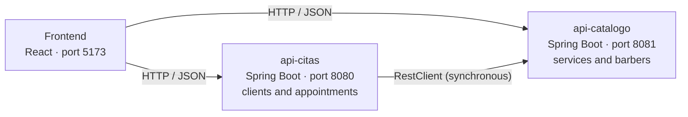

# Barbershop management system

Second-term project for **Solution Design** — Systems Engineering.
Group 8: Daniel Felipe Vanegas and Camilo Andrés Paternina.

The barbershop books appointments: each appointment joins a client, a service and a barber.
We split the system into two Spring Boot microservices and a web interface that consumes them.

## Architecture



| Part | Folder | What it does |
|---|---|---|
| api-catalogo | `api-catalogo/` | CRUD for the services the barbershop offers and for the barbers. |
| api-citas | `api-citas/` | CRUD for clients and appointments. To book, it looks up the service and the barber in api-catalogo. |
| Frontend | `frontend/` | Web interface to manage the four entities and see the status of the microservices. |

Each microservice runs separately, has its own controllers and stores its own data. The
data lives in memory: when a microservice restarts it goes back to its demo data.

### Communication between microservices

To book an appointment the client sends only the IDs:

```json
{ "clienteId": 1, "servicioId": 3, "barberoId": 1, "fechaHora": "2026-12-01T10:00" }
```

1. `CitaController` receives the `POST /api/citas`.
2. `CitaService` looks up the client, which belongs to api-citas.
3. `CatalogoCliente` sends `GET /api/servicios/{id}` and `GET /api/barberos/{id}` to api-catalogo with `RestClient`.
4. With the three responses the appointment is validated, saved and answered with `201`.

The communication is synchronous: api-citas waits for api-catalogo's response before
continuing. If api-catalogo is down, api-citas answers `503` with a clear message and the
rest of its endpoints (clients, querying appointments) keep working. The other
microservice's URL is in `application.properties` (`api.catalogo.url`), not in the code.

## How to run

Requirements: **JDK 17 or later** and **Node.js 20 or later**. Maven is not needed: each
microservice ships its own wrapper (`mvnw`).

Open three terminals at the repository root.

**1. api-catalogo** (port 8081)

```bash
cd api-catalogo
./mvnw spring-boot:run
```

**2. api-citas** (port 8080)

```bash
cd api-citas
./mvnw spring-boot:run
```

**3. Frontend** (port 5173)

```bash
cd frontend
npm install
npm run dev
```

On Windows (PowerShell or CMD) the wrapper is called `.\mvnw.cmd`.

| Address | What is there |
|---|---|
| http://localhost:5173 | Web interface |
| http://localhost:8081/swagger-ui.html | Swagger for api-catalogo |
| http://localhost:8080/swagger-ui.html | Swagger for api-citas |

The frontend has to run on port 5173 because it is the only origin the microservices
accept through CORS (`frontend.url` in each `application.properties`).

## REST API

The full table of endpoints per controller is in
[docs/endpoints.pdf](docs/endpoints.pdf) (also in Word: `docs/endpoints.docx`).

The four resources follow the same scheme:

| Method | Endpoint | Operation |
|---|---|---|
| `POST` | `/api/{resource}` | Create |
| `GET` | `/api/{resource}` | List |
| `GET` | `/api/{resource}/{id}` | Get one |
| `PUT` | `/api/{resource}/{id}` | Update |
| `DELETE` | `/api/{resource}/{id}` | Delete |

`{resource}` is `servicios` or `barberos` in api-catalogo, and `clientes` or `citas` in
api-citas. In addition:

- `PATCH /api/citas/{id}/estado` changes only an appointment's status (complete or cancel).
- `GET /api/conexion/catalogo` checks, from api-citas, that api-catalogo responds.
- `GET /api/status` on each microservice.

Errors always arrive as `{"mensaje": "..."}` with the matching code: `400` invalid data,
`404` not found, `409` conflicts with the current data, `503` the other microservice did
not respond.

### JSON and XML

The services' `GET` endpoints return JSON or XML depending on the `Accept` header:

```bash
curl -H "Accept: application/xml" http://localhost:8081/api/servicios/1
```

```xml
<ServicioDTOResponse><id>1</id><nombre>Corte clásico</nombre>...</ServicioDTOResponse>
```

## Business rules

- An appointment is only booked with a service and a barber that are **active** in the catalog.
- Appointments are not booked on a past date.
- A barber cannot have two scheduled appointments that overlap. The overlap is computed
  with the service's duration.
- An appointment starts as `PROGRAMADA` (scheduled) and can only move to `COMPLETADA`
  (completed) or `CANCELADA` (cancelled). Once closed it is not modified.
- A client with scheduled appointments is not deleted.
- Client and barber ID documents and service names are not repeated.
- The appointment keeps the service's name and price it was booked with, even if they
  later change in the catalog.

## Structure of each microservice

```
controller/   REST endpoints and the error handler
service/      business rules and in-memory data
model/        domain entities
dto/          what the API receives (DTORequest) and what it returns (DTOResponse)
cliente/      communication with the other microservice (api-citas only)
config/       RestClient and CORS
```

## What we applied from each class

| Topic | Where it is |
|---|---|
| Microservices | Two independent Spring Boot applications, each with its own port and data. |
| API First | We designed the resources and endpoints first (`docs/endpoints.pdf`). Swagger UI documents each API. |
| Layered architecture | `Controller → Service → Model` in both microservices. |
| HTTP methods | `GET`, `POST`, `PUT`, `PATCH` and `DELETE`, with their response codes. |
| JSON, Jackson and DTOs | One `DTORequest` and one `DTOResponse` per resource. The client never sends the `id` or an appointment's status: the application sets them. |
| XML | `jackson-dataformat-xml` and `produces` with JSON and XML in `ServicioController`. |
| Synchronous communication | `CatalogoCliente` + `RestClientConfig` in api-citas. |

We use Spring Boot 4, which ships Jackson 3. That is why the XML dependency is
`tools.jackson.dataformat:jackson-dataformat-xml` and not the `com.fasterxml` one from Jackson 2.

## Interface

Built with React and Vite, with no component library: the styles are in
`frontend/src/estilos.css`.

- Sidebar with the five sections: Inicio (home), Citas (appointments), Clientes (clients),
  Servicios (services) and Barberos (barbers).
- Each section has a table, a search or filter, a form to create and edit, and a
  confirmation before deleting.
- The forms validate before submitting and show the API's message when it rejects the
  operation.
- While the data arrives, skeletons shaped like the content are shown.
- Light and dark theme. The choice is remembered and, the first time, the system's is used.
- Inicio shows the upcoming appointments and whether each microservice and the connection
  between them are online.
- It adapts to small screens and respects the reduced-motion preference.

## Tests

```bash
cd api-catalogo && ./mvnw test
cd api-citas && ./mvnw test
```

There are 38 tests with JUnit and MockMvc. The api-citas ones replace `CatalogoCliente`
with a Mockito double, so the appointment rules and the catalog-down case are tested
without having to start the other microservice.

## Scope of this term

- The data is in memory. The database arrives in the third term.
- There is no authentication. The endpoints are open and CORS only accepts the frontend's
  origin. Security with JWT is also for the third term.
